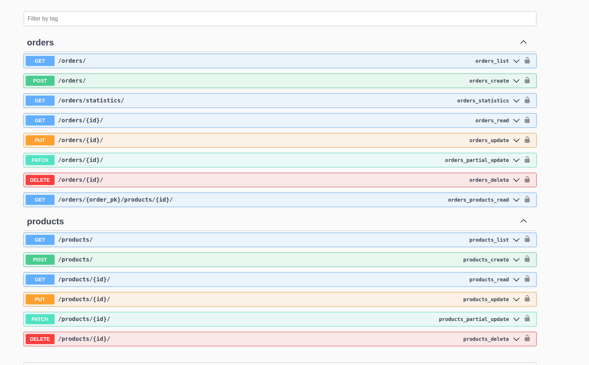
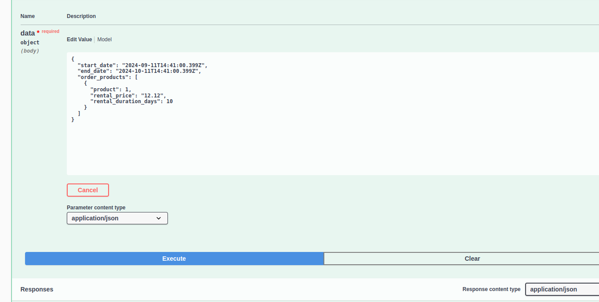
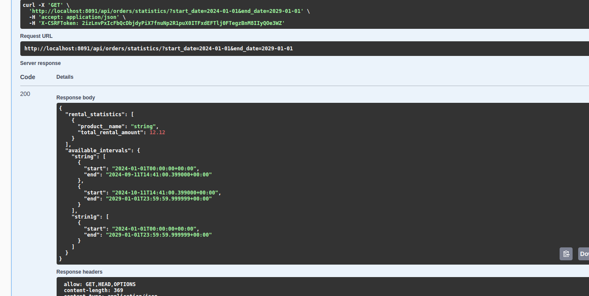

# Проект аренды

## Установка и запуск

### Создание виртуального окружения

Для создания виртуального окружения используйте следующую команду:

```bash
python3 -m venv venv
```

После создания виртуального окружения вам нужно его активировать.

```bash
source venv/bin/activate
```

После активации виртуального окружения установите зависимости проекта, используя pip:

```bash
pip install -r requirements.txt
```

Запуск Django приложения
```bash
sh ./entrypoint.sh
```

Переходим в сваггер
http://localhost:8090/swagger/



### Создание продукта через post запрос
/products/

### Создание аренды:



Выбираем даты, id продукта, цена аренды и продолжительность аренды.


### Статистика:

Выбираем даты 


Получаем свободные даты продуктов и общее количество суммы аренды.

